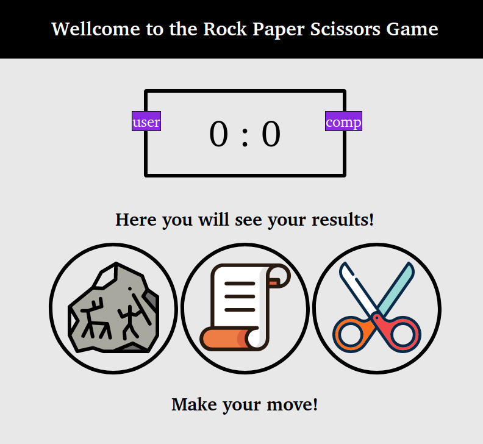

# An implementation of Rock Paper Scissorcs game using Javascript

  

You can find the game here: www.ionpetro.com/rpc-game

This game was developed for educational reasons. 

By Implementing this game I learned the following:

* How to change the content of HTML elements
* How to change the style (CSS) of HTML elements
* How to react to HTML DOM events
* How to add and delete HTML elements
* How to parse Javascript Objects with arrays
